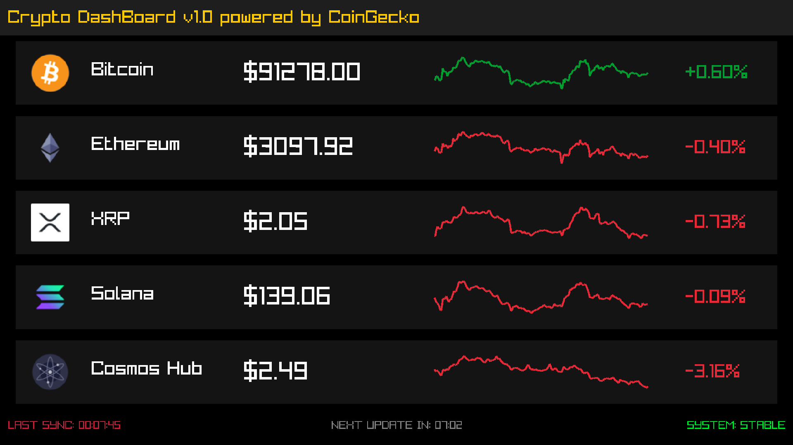

# Raspberry PI crypto Display


A high-performance, Raylib-based cryptocurrency dashboard for the Raspberry Pi. This project leverages the CoinGecko API to provide real-time market data with optimized polling intervals and features a custom hardware-abstracted trigger via USB for automatic lifecycle management.



## Built With

- **C++** - Core programming language.
- **Raylib** - Hardware-accelerated graphics library.
- **libcurl** - Stable API networking.
- **nlohmann/json** - Modern C++ JSON parsing.
- **Bash** - Automation and system monitoring.

## Project Structure

```text
RaspberryProject/
├── src/                    # Source files (.cpp)
│   ├── main.cpp            # UI logic and Raylib loop
│   └── cryptoAPI.cpp       # API communication implementation
├── include/                # Header files (.h)
│   ├── cryptoAPI.h         # API class definitions
│   ├── json.hpp            # JSON library
│   └── mockdata.h          # Mock data for development/testing
├── build/                  # Compiled binaries (excluded via .gitignore)
├── .gitignore              # Tells git to ignore some files
├── sentry.sh               # Background USB monitoring script
├── .env                    # API Keys (PRIVATE - Excluded from Git)
├── CMakeLists.txt          # Build configuration file
├── LICENSE                 # MIT License file
```

## Initial Setup (USB)

1. Rename a USB thumbdrive to exactly: `CRYPTOS`
2. Add a `config.json` file on the usb drive
3. Copy and paste this structure into `config.json`:

```json
{
  "api_settings": {
    "use_mock_data": false,
    "coin_ids": ["bitcoin", "dogecoin", "solana", "ripple", "cosmos"],
    "update_interval_current_seconds": 450,
    "update_interval_historic_seconds": 86400,
    "api_delay_ms": 1000
  },
  "wifi_settings": {
    "ssid": "Enter your Wifi SSID HERE (NO SPACES)",
    "password": "Enter Wifi password HERE (No SPACES)",
    "retry_attempts": 6,
    "retry_delay_seconds": 5
  },
  "window_settings": {
    "screenW": 1024,
    "screenH": 600,
    "title": "Crypto Dashboard v1.0 powered by CoinGecko"
  },
  "ui_colors": {
    "header_color": [30, 30, 30, 255],
    "row_bg_color": [20, 20, 20, 255],
    "text_color_gold": [255, 203, 0, 255]
  }
}
```

## Initial Setup (Desktop Rule)

1. Download the Code (ZIP) from Github

2. **IMPORTANT**: Unzip and retrieve `RaspberryProject` folder, and place that on Raspberry Pi Desktop. Structure of this folder should follow structure above.
   - path must be: `/home/pi/Desktop/RaspberryProject/`
3. Make sure Raspberry Pi is connected to `INTERNET`

## Install system dependencies

You must install these libraries so the Pi can handle the graphics, the internet connection (CURL), and the JSON data. Open the Terminal and enter the following BASH commands:

### 1. Update your system

```bash
sudo apt update && sudo apt upgrade -y
```

### 2. Install required dependencies

```bash
sudo apt install build-essential cmake libcurl4-openssl-dev nlohmann-json3-dev \
libasound2-dev libx11-dev libxcursor-dev libxinerama-dev \
libxrandr-dev libxi-dev libgl1-mesa-dev libgbm-dev libdrm-dev libegl1-mesa-dev
```

## Configuration (API Keys)

This project uses a `.env` file to store your API credentials.

1. Create a file named `.env` in the root folder.
2. Add CoinGecko API key, FOLLOW STRUCTURE EXACTLY (SPACES INCLUDED):

```bash
api_key = {Enter API KEY here}
```

### 4. Build the project ( make build directory and cmake)

Navigate to the project directory `/home/pi/Desktop/RaspberryProject/`, and then enter these commands:

```bash
mkdir -p build
cd build
cmake .. -DPLATFORM=Desktop -DOPENGL_VERSION="ES 2.0"
make -j$(nproc)
```

#### VERIFY RASPBERRYPROJECT exists with `ls` command in while in build folder

---

### Add a Sentry script

This is basically a "while true" loop that sits in the background on your Raspberry Pi and checks for the `CRYPTOS` usb to be plugged in.

1. Make Sentry script executable

```bash
chmod +x ~/Desktop/RaspberryProject/sentry.sh
```

### Make the Sentry script start when Pi powers on

1. Create the Autostart Directory

```bash
   mkdir -p /home/pi/.config/autostart
```

2. Create the "Crypto Launcher" File

```bash
   nano /home/pi/.config/autostart/crypto_launch.desktop
```

3. Paste this Configuration

```bash
   [Desktop Entry]
   Type=Application
   Name=Crypto Dashboard Sentry
   Exec=/home/pi/Desktop/RaspberryProject/sentry.sh
   Terminal=false
```

4. Verify the Script Path
   Before you reboot, we must ensure your sentry.sh is actually where we think it is. If this command returns an error, the autostart will fail.

```bash
   ls -l /home/pi/Desktop/RaspberryProject/sentry.sh
```

---

### Cusomizing the Dashboard -- config.json

---

You can change how the dashboard looks and behaves by editing the `config.json` file. You do not need to recompile the code after changing these values, just restart the program

---

#### Changing Coins

Find the `coin_ids list`. You can add or remove any coin supported by CoinGecko (use their "API ID" found on their website).

```json
"coin_ids": ["bitcoin", "ethereum", "dogecoin", "solana"]
```

---

#### Screen Resolution

If the screen demonsions are unknown, enter this BASH command on the pi connected to the screen:

```bash
xrandr | grep '*'
```

Then modify screenW & screenH values accordingly.

---

#### Adjusting Colors

Colors are set using RGBA format [Red, Green, Blue, Alpha]. Values range from `0` to `255`

---

#### Updating Invtervals

- `update_interval_current_seconds`: How often the price and return data update, I have set to 7.5 minutes to be well under CoinGecko Demo limit.

- `update_interval_historic_seconds`: How often the historic graph chagnes. I have set to 24 hours, I would not suggest modifying this one.

- `api_delay_ms`: The "wait time" between fetching each coin's history. Keeping this at 1000 (1 second) is recommended for the free CoinGecko tier.
