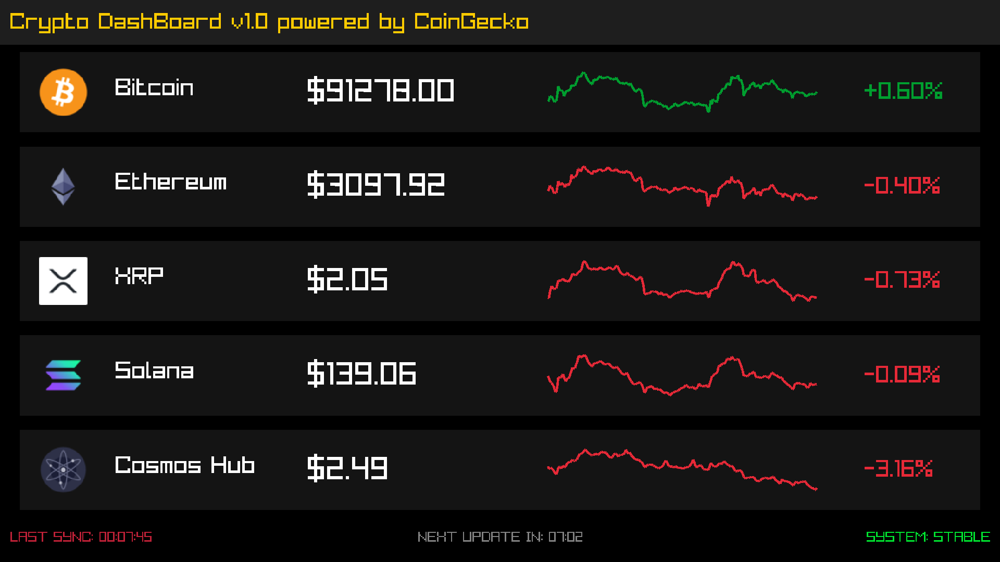

# CryptoDisplay


A plug-in cryptocurrency dashboard powered by the [CoinGecko](https://www.coingecko.com/) API. Plug in a USB device labeled `CRYPTOS` and a fullscreen price dashboard (live prices, returns, historic sparklines) appears; unplug it and the dashboard closes.

This repo holds two generations of the project:

| | **[Version 1 — Raspberry Pi](Version1/README.md)** | **[Version 2 — XIAO Trigger](Version2/README.md)** |
|---|---|---|
| **Idea** | A native app installed on a Raspberry Pi, started when a `CRYPTOS` USB stick is inserted | A XIAO RP2040 chip that *carries* the dashboard and launches it on any computer it's plugged into |
| **Runs on** | Raspberry Pi only | Windows or Linux (incl. Raspberry Pi OS) |
| **Dashboard** | C++ / Raylib (compiled) | HTML / CSS / JS in a kiosk-mode browser |
| **Host setup** | Install deps, build with CMake, add `sentry.sh` to autostart | None — uses the browser the OS already has |
| **Launch trigger** | `sentry.sh` background loop watches for the USB | Chip acts as a USB keyboard (HID) and types the launch command |
| **Config** | `config.json` on the USB stick; API key in `.env` | `dashboard/config.js` on the chip |
| **Hardware** | Raspberry Pi + screen + USB stick | Seeed XIAO RP2040 (CircuitPython) + any computer/screen |



## Repository layout

```text
CryptoDisplay/
├── README.md               # This file — overview of both versions
├── LICENSE                 # MIT
├── docs/
│   └── v1-screenshot.png
├── Version1/               # Version 1 — native C++ Raspberry Pi app
│   ├── README.md           # Full Version 1 setup/build guide
│   ├── src/  include/      # C++ sources and headers
│   ├── CMakeLists.txt
│   ├── config.json         # Example USB config
│   └── sentry.sh           # USB watcher that launches the app
└── Version2/               # Version 2 — self-launching XIAO RP2040 dashboard
    ├── README.md           # Full Version 2 setup guide
    ├── boot.py             # CircuitPython: labels the drive CRYPTOS
    ├── code.py             # CircuitPython: types the launch command (HID keyboard)
    ├── launch.ps1          # Windows launcher (runs from the chip)
    ├── launch.sh           # Linux launcher (runs from the chip)
    └── dashboard/          # Web dashboard (index.html, style.css, app.js, config.js)
```

> Version 1's `sentry.sh` expects the folder to live at `/home/pi/Desktop/Version1/` on the Pi.

## Which one should I use?

- **Version 2 (XIAO Trigger)** if you want a portable, zero-install dashboard you can plug into any Windows or Linux machine. This is the current version.
- **Version 1 (Raspberry Pi)** if you want a dedicated, always-on Raspberry Pi display running a compiled native app.

## Getting started

- Version 1: see [Version1/README.md](Version1/README.md)
- Version 2: see [Version2/README.md](Version2/README.md)

## License

MIT — see [LICENSE](LICENSE).
