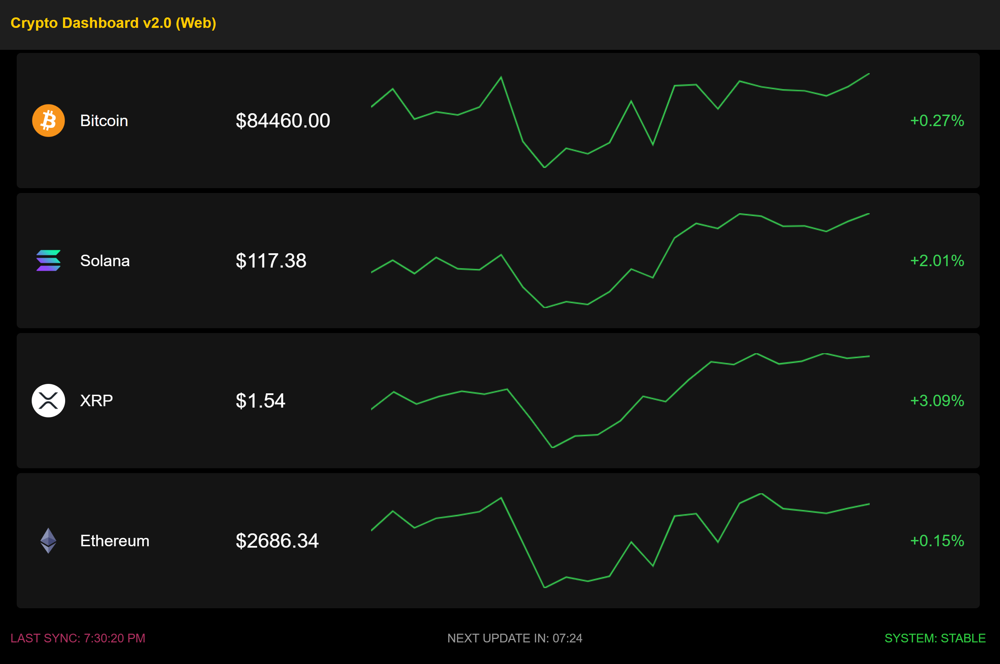

# Crypto Display V2-XIAO

> Part of [CryptoDisplay](../README.md). This is Version 2, the successor to
> [Version 1](../Version1/README.md) (Raspberry Pi).

A Seeed XIAO RP2040 that carries a self-contained crypto dashboard and launches it fullscreen on whatever computer you plug it into: a Windows PC or a Raspberry Pi / Linux desktop. Nothing gets installed on the host. The dashboard is a plain HTML/JS page, and every OS already ships a browser to run it in.

## Screenshot of interface



## How it works

The chip shows up on the host as **two USB devices at once**:

- a **USB drive** labeled `CRYPTOS`, holding the launch scripts and the dashboard
- a **keyboard** (USB HID)

On plug-in, `code.py` on the chip:

1. waits `BOOT_SETTLE_SECONDS` for the drive to mount
2. presses **Win+D** so a Windows AutoPlay window can't steal focus
3. **Windows:** presses **Win+R** and types a command that finds the `CRYPTOS` drive and runs `launch.ps1`
4. **Linux:** presses **Ctrl+Alt+T** and types a command that finds the `CRYPTOS` drive and runs `launch.sh`

Only the shortcut for the host's actual OS does anything. The other one is harmless.

The launch script opens the browser in `--kiosk` mode (fullscreen, no browser UI) on `dashboard/index.html`. That's Edge on Windows, or Chromium/Chrome/Edge on Linux. A watcher then checks every 2 seconds whether the drive is still there. **Unplug the chip and the browser closes.**

On Windows, the PowerShell window stays up for about 6 seconds so it catches the chip's leftover Linux keystrokes, which then do nothing. It then brings the dashboard to the front and closes itself. The watcher keeps running hidden in the background.

The dashboard pulls live prices, 24h change and a 24h sparkline for each coin from the [CoinGecko](https://www.coingecko.com/) API, so the host needs internet access.

## Folder structure

```text
Version2/
├── README.md         # This file
├── boot.py           # Runs first on the chip: labels the drive CRYPTOS, disables autoreload
├── code.py           # Chip's main program: types the launch command via HID keyboard
├── launch.ps1        # Windows launcher (opens Edge in kiosk mode, closes it on unplug)
├── launch.sh         # Linux launcher (opens Chromium in kiosk mode, closes it on unplug)
└── dashboard/
    ├── index.html    # Dashboard page
    ├── style.css     # Layout and colors
    ├── app.js        # Fetches CoinGecko data, draws rows and sparklines
    └── config.js     # Your settings: coins, title, update intervals, colors, API key
```

Once set up, the chip's `CRYPTOS` drive looks like this:

```text
CRYPTOS/
├── boot.py
├── code.py
├── launch.ps1
├── launch.sh
├── lib/
│   └── adafruit_hid/   # From the Adafruit CircuitPython Bundle (step 4)
└── dashboard/
    ├── index.html
    ├── style.css
    ├── app.js
    └── config.js
```

## How to set up

### What you need

- A **Seeed XIAO RP2040** and a USB-C data cable (not a charge-only one)
- A computer to set it up from
- A host to display on:
  - **Windows 10/11:** uses the built-in Edge. Nothing to install.
  - **Raspberry Pi OS / Linux desktop:** needs Chromium, Chrome or Edge (Raspberry Pi OS includes Chromium) and a desktop where **Ctrl+Alt+T** opens a terminal.
- Internet access on the host

### 1. Put the chip in bootloader mode

Hold the **BOOT** button on the XIAO, plug it into your computer, then let go. A drive named `RPI-RP2` appears.

### 2. Install CircuitPython

Download the CircuitPython `.uf2` for **Seeed XIAO RP2040** from [circuitpython.org](https://circuitpython.org/board/seeeduino_xiao_rp2040/) and drag it onto `RPI-RP2`. The chip reboots and shows up as a drive named `CIRCUITPY`.

### 3. Copy the chip scripts

Copy `boot.py` and `code.py` from this folder to the root of `CIRCUITPY`. Overwrite the existing files if asked.

### 4. Add the keyboard library

1. Download the **Adafruit CircuitPython Bundle** matching your CircuitPython version (e.g. `8.x` or `9.x`) from [circuitpython.org/libraries](https://circuitpython.org/libraries).
2. Unzip it, find the `adafruit_hid` folder inside its `lib/` folder.
3. Copy that whole `adafruit_hid` folder into `lib/` on the chip. Create `lib/` if it doesn't exist.

### 5. Copy the dashboard

Copy `launch.ps1`, `launch.sh` and the whole `dashboard/` folder to the root of the chip, next to `boot.py` and `code.py`.

### 6. Set your coins

Open `dashboard/config.js` on the chip in any text editor and set your coins and settings. See [Configuration](#configuration) below.

### 7. Relabel the drive

Unplug the chip and plug it back in. `boot.py` renames the drive on startup, so it should now show up as **`CRYPTOS`** instead of `CIRCUITPY`.

> The keyboard starts typing as soon as the chip is plugged in. From now on, when you only want to edit files, plug it into a computer where a stray Run box or terminal won't matter, or be ready to close them.

### 8. Test it

Plug the chip into the host and leave the keyboard and mouse alone for about 10 seconds. You should see:

1. the desktop show (Win+D)
2. a Run box (Windows) or terminal (Linux) open and a command type itself
3. the browser open fullscreen with the dashboard

Unplug the chip and the dashboard closes. If something doesn't work, see [Troubleshooting](#troubleshooting).

## Configuration

All settings live in `dashboard/config.js` on the chip. Edit it in a text editor, save, then unplug and replug to apply.

```js
const CONFIG = {
  title: "Crypto Dashboard v2.0 (Web)",
  coin_ids: ["bitcoin", "dogecoin", "solana", "ripple", "ethereum"],
  update_interval_current_seconds: 450,
  update_interval_historic_seconds: 86400,
  api_delay_ms: 1000,
  api_key: "",
  ui_colors: {
    header_bg: "#1e1e1e",
    row_bg: "#141414",
    gold: "#ffcb00",
  },
};
```

| Setting                            | What it does                                                                                                                                                  |
| ---------------------------------- | ------------------------------------------------------------------------------------------------------------------------------------------------------------- |
| `title`                            | Text in the header bar                                                                                                                                        |
| `coin_ids`                         | Coins to show, top to bottom. Use the **API ID** from each coin's CoinGecko page (e.g. `bitcoin`, `ethereum`, `ripple` for XRP). About 5 fit the screen well. |
| `update_interval_current_seconds`  | How often prices refresh. 450 (7.5 min) stays well within CoinGecko's free limits.                                                                            |
| `update_interval_historic_seconds` | How often the sparkline charts refresh. 86400 = once a day.                                                                                                   |
| `api_delay_ms`                     | Pause between each coin's chart request. Raise it if a chart row comes up blank.                                                                              |
| `api_key`                          | Optional CoinGecko **Demo** API key. Leave `""` to use the public, more rate-limited API.                                                                     |
| `ui_colors`                        | Hex colors for the header, row backgrounds and accent text                                                                                                    |

### Timing (in `code.py`)

| Setting               | Default | Raise it if…                                                                                                                |
| --------------------- | ------- | --------------------------------------------------------------------------------------------------------------------------- |
| `BOOT_SETTLE_SECONDS` | 5       | nothing types at all, especially when the chip is already plugged in while the host boots (use about 25 for a Pi cold boot) |
| `WINDOW_OPEN_SECONDS` | 2       | the Run box / terminal opens but the typed command is cut off or lands elsewhere                                            |

## Troubleshooting

- **Nothing types at all:** raise `BOOT_SETTLE_SECONDS`. Also check that `lib/adafruit_hid/` is on the chip. Without it, `code.py` fails silently.
- **Windows: the Run box opens but the command fails:** open PowerShell and run `(Get-Volume -FileSystemLabel CRYPTOS).DriveLetter`. It should print the chip's drive letter. If it prints nothing, the drive isn't labeled `CRYPTOS` (redo step 7).
- **Linux: no terminal opens:** Ctrl+Alt+T isn't bound on every desktop. Bind it to your terminal in that desktop's keyboard settings.
- **The command types before the window is ready:** raise `WINDOW_OPEN_SECONDS`.
- **Pi: the browser flashes, then closes ("Trace/breakpoint trap"):** Chromium crashed on startup. `launch.sh` automatically retries once without GPU acceleration (`--disable-gpu`), so this should fix itself. If it still closes, check the browser's log at `/run/user/1000/crypto-kiosk.log` (or `/tmp/crypto-kiosk.log`). Don't run `launch.sh` with `sudo`: Chromium refuses to run as root. A "GetRenderStyleForStrike … Arial" line in the log is a harmless font warning.
- **Browser opens but the page is blank:** `config.js` probably has a typo, such as a missing comma or quote. Check it against the example above.
- **No prices or icons:** check the host's internet connection. If you've been replugging a lot, you may have hit CoinGecko's public rate limit. Wait a minute, or add an `api_key`.
- **It keeps relaunching over and over:** `boot.py` is missing or outdated on the chip. It must turn off CircuitPython's autoreload, otherwise any file change on the drive restarts `code.py`. Recopy it.
- **Browser doesn't close on unplug:**
  - **Windows:** check Task Manager for a background `Windows PowerShell` process (the hidden watcher). If it's missing, the watcher never started. Replug, and the launcher closes any leftover kiosk before starting a new one.
  - **Linux:** the terminal that `Ctrl+Alt+T` opened was closed early. Leave it open behind the dashboard.
- **Windows: the PowerShell window stays in front:** it should close by itself about 6 seconds after the dashboard appears. If it doesn't, make sure the chip has the latest `launch.ps1`.
